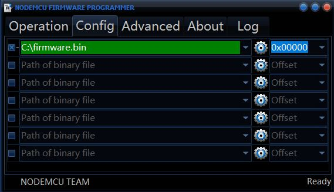

!> **Bei der aktuellen Controller Firmware ist es nicht notwendig eine Config Datei zu verändern**.
Alle Einstellungen können nun ganz bequem per Hotspot eingestellt werden.
Hier in dieser Anleitung ist beschrieben, wie eine fertige .bin Datei auf den ESP8266 geflasht werden kann. Das Kompilieren des Quellcodes (wie früher notwendig) wird hier nicht weiter beschrieben.

## Flashen

### Flashen unter Windows

**1.** Lade dir das Flashing Tool [hier](https://blueforcer.de/downloads/ESP8266Flasher.exe) herunter.

**2.** Lade dir die aktuelle Firmware [hier](https://blueforcer.de/awtrix/stable/firmware.bin) herunter.

**3.** Starte die **ESP8266Flasher.exe** und öffne die Firmware im Tab "Config" (Zahnrad klicken um die Firmware auszuwählen)

**4.** Gehe zurück in den Tab "Operation" und stelle  den richtigen Com-Port ein falls dieser nicht automatisch erkannt wurde.

**5.** Klicke auf "Flash" und warte bis der Vorgang abgeschlossen ist und in der unteren linken ecke ein grüner haken erscheint.

**6.** Starte den Controller neu.

<div align=center>
  
  
</div>

### Flashen unter Linux & MacOS

Hierfür kann das ESPTool verwendet werden

```bash
git clone https://github.com/themadinventor/esptool.git
```

Wenn du kein git hast, kannst du es mit dem entsprechenden Befehl herunterladen:
[Installation von git auf verschiedenen Distributionen](http://git-scm.com/download/linux)

Wir benötigen auch Python auf unserem System, um dieses Skript mit dem seriellen Paket auszuführen (es sollte bereits installiert sein, aber nur für alle Fälle).

Im Terminal ändern wir den aktuellen Ordner in den Pfad des esptool-Ordners und geben diesen Befehl ein, um die Firmware herunterzuladen:

```bash
sudo wget -h https://blueforcer.de/awtrix/stable/firmware.bin
```

Anschließend wird der Flashprozess gestartet

```bash
sudo python esptool.py --port /dev/ttyUSB0 write_flash 0x00000 firmware.bin
```

Beachte, dass sich **/dev/ttyUSB0** je nach dem von Ihnen verwendeten UART und der von Ihnen gewählten Linux-Distribution ändern kann.

Wenn nach einigen Sekunden ähnliche Outputs zu lesen sind:

```bash
Connecting.....
Erasing flash.....
Writing at 0x00000000... (0 %)
```

Dann ist alles in Ordnung....
Wenn es nach ein paar Sekunden nicht angezeigt wird, hast du möglicherweise ein Problem mit dem Anschluss des ESP8266 an den UART.

## Update
Du kannst die Firmware auf drei Arten aktualisieren:

- Flashe die neueste firmware.bin per USB und einem PC
- Öffnen die IP des Controllers in einem Browser und lade die firmware.bin hoch
- Gehe im Host-Webinterface auf Matrix-Status und klicke auf "Update verfügbar".

## Erster Start
<div align=center>
  
</div>

Für ein paar Sekunden sucht der Controller nun nach einem bekannten WiFi Netzwerk.

<br/><br/>

<div align=center>
  
</div>

Wenn noch keine Wifi Verbindung konfiguriert ist kommt nun der Text "Hotspot" auf der Matrix. Wie der Name schon sagt, macht der Controller nun einen WLAN Hotspot auf. Mit einem beliebigen WLAN Gerät kann der Controller nun über den Hotspot konfiguriert werden.
1. Verbinde dich mit dem WLAN mit der SSID "**AWTRIX Controller**".
2. Das WLAN Passwort lautet "**awtrixxx**"
3. Wenn sich nicht automatisch eine Webseite öffnet, kann unter der IP "**172.217.28.1**  über einen beliebigen Browser auf die Einstellungsseite navigiert werden. Diese Seite sieht wie folgt aus:

<div align=center>
  
  
</div>

4. Durch klicken auf "Conigure WiFi" (linkes Bild) gelangt man auf die eigentliche Einstellungsseite (rechtes Bild).

5. **SSID** und **Passwort** eures WLANs muss in die dafür vorgesehene Felder eingetragen werden.

!> **Der Controller braucht zwingend ein WLAN - ansonsten startet er nicht. Dies wird als fallback Verbindungsmethode und automatisches Update über den Host genutzt**

6. Trage die **Host-IP** ein. Dieses ist die IP Adresse des Gerätes, auf dem die Host-Software läuft z.B ein Raspberry. Hier wird **kein** http:// oder port mit angegeben!

7. Als **Port** sollte 7001 stehen bleiben. Dieser Port wird zur Datenkommunikation genutzt und sollte nicht geändert werden. Dieser Port hat nichts mit dem Host-Webinterface unter Port 7000 zu tun!

8. Sollte deine Matrix nur komische Pixel anzeigen, so ist die Anordnung der LEDs auf der Matrix anders. Dies kannst du beheben in dem du die Ansteuerung mit **MatrixType2** anpassen

<br/><br/>

## Bekannte Probleme

- Sollten andere Probleme auftreten kannst du versuchen deinen Wemos zurück zu setzen. Dabei werden alle gespeicherte Informationen gelöscht und du kannst ihn erneut über den Hotspot einrichten.
  Dazu gibt es 3 wege:

**Über die Touchtaster**
- Schalte die Matrix aus und wieder ein.
- Während die Matrix "BOOT" anzeigt, halte den mittleren Drucktaster gedrückt
- Warte, bis der Reset-Countdown abgelaufen ist

**Über den PC**
- Lade dir das [ESP8266 download tool](https://www.espressif.com/en/support/download/other-tools)
- Schließe deinen Wemos an den PC an öffne die Software und klicke **erase**

<br/>

<div align=center>
  
</div>
