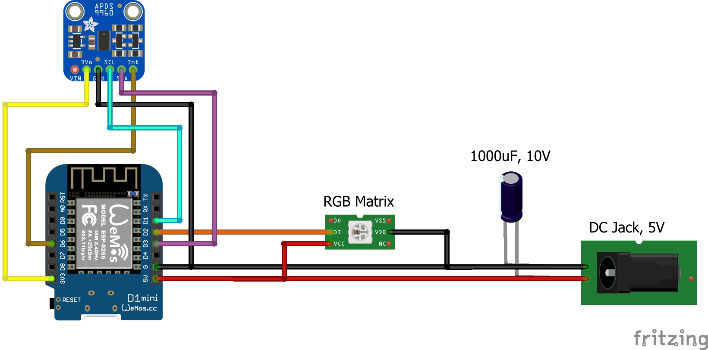

# **Elektronik**

Die Elektronik kann entweder auf eine Lochrasterplatine gelötet ("frei verdrahtet") werden oder auf der extra für Awtrix entwickelten Leiterplatte. Die genauen Details zu den benötigten Bauteilen bitte der [Teileliste](/de-de/hardware_awtrix_pro/partlist_pro) entnehmen.

## Basis Variante

## Optionaler Lichtsensor zur Helligkeitsregelung

## Optionaler DFPlayer Mini als Soundausgabe

| Wemos | DFPlayer Mini | Funktion | Hinweis  |
| ----- | ------------- | -------- | -------- |
| 5V    | VCC           | Spannungsversorgung (+)    |          |
| G     | GND           | Spannungsversorgung (-)   |          |
| D7    | TX            | Transmit |          |
| D5    | RX            | Receive  | früher D8 |

## Optionaler Temperatursensor

| Wemos | BME280 | Htu21d | Funktion | Hinweis  |
| --- | --- | --- | --- |--- |
| 3.3V | VCC |  VCC |Spannungsversorgung (+) | nicht 5V kompatibel! |
| GND | GND | GND |Spannungsversorgung (-) | |
| D3 | SDA | SDA |I2C Data | |
| D1 | SCL | SCL |I2C Clock | |

Bei Verwendung von Temperatursensor und Gestensensor werden die Pins D1 & D3 des Wemos D1 mini doppelt verwendet (Bus).

## Optionaler Gestensensor für Bedienung

| Wemos | APDS-9960 | Funktion | Hinweis  |
| --- | --- | --- | --- |
| 3.3V | VCC | Spannungsversorgung (+) | nicht 5V kompatibel! |
| GND | GND | Spannungsversorgung (-) | |
| D3 | SDA | I2C Data | |
| D1 | SCL | I2C Clock | |
| D6 | INT | Interrupt |  |

Bei Verwendung von Temperatursensor und Gestensensor werden die Pins D1 & D3 des Wemos D1 mini doppelt verwendet (Bus).

## Serielle Verbindung oder USB-Verbindung zur Matrix

Wenn es probleme bei der WiFi-Übertragung zwischen Server und Controller gibt, gibt es die Möglichkeit den Server direkt per Serial an den Controller (Wemos D1 Mini) anzuschließen.

Auf Controller-Seite muss hierfür im Hotspot Menü der Haken bei Serial gesetzt werden. Außerdem braucht der Wemos weiterhin zwingend eine Verbindung zu einem Netzwerk. Ansonsten öffnet er immer wieder den Hotspot und zeigt damit auch nichts anderes an.
Die WiFi Verbindung wird verwendet, um den Controller auch weiterhin updaten zu können.

Es kann auch der **USB-Port** des Pi's verwendet werden (auch für jede andere Serverplattform). Dazu muss man einfach den Server per microUSB-Kabel an den Wemos D1 anschließen.

Bei Verwenudng der **GPIO's** wird der Pi wie folgt mit dem Wemos verbunden:

| Wemos | Raspberry Pin-No | Funktion |
| ----- | ---------------- | -------- |
| 5V    | 04 - 5V          | Spannungsversorgung (+) |
| GND   | 06 - GND         | Spannungsversorgung (-)   |
| RX    | 08 - TXD         | Transmit |
| TX    | 10 - RXD         | Receive  |

**Bitte zwingend auf die Raspberry Version achten. Hier kann es unterschiede geben!**

Standartmäßig muss beim Raspberry die serielle Schnittstelle freigeschaltet werden, dazu folgende Zeile in der /boot/config.txt eingetragen werden  
`enable_uart=1`
