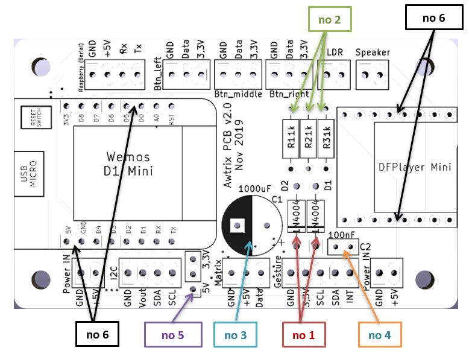

Wenn du keine Lust auf eine fliegende Verdrahtung im Gehäuse hast, [kannst du eine geeignete Platine in meinem Shop erwerben](https://blueforcer.de/shop/).

Den Bestückungsplan dafür findest du hier:

| Nr | Stück | Name | Teilenummer (reichelt.de) | Kommentar
| -  | - |:------------------------:| :------------------------------:| |
| **1**  | 2 | diode (1N4004) |1N 4004 |
| **2**  | 3 | resistor (1k Ohm)| VIS C1001FC100 | |
| **3**  | 1 | Capacitor (1000uF)| M-A 1000U 16 | Liegend verbauen |
| **4**  | 1 | Capacitor (100nF)| KERKO 100N |  |
| **5**  | 1 | pinheader male (1x3) |  MPE 087-1-036 | |
| **6**  | 4 | pinheader male (1x8)  |  MPE 087-1-036 | | 

