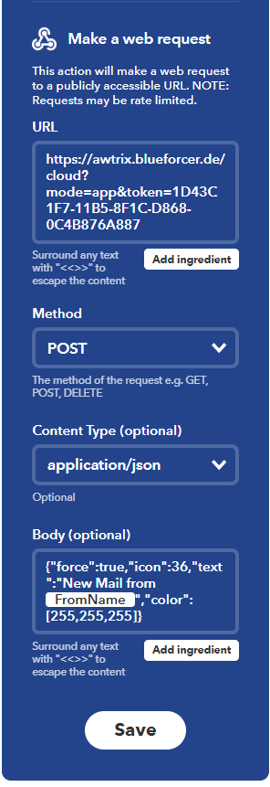

## AWTRIX Cloud
The goal of the AWTRIX Cloud is to bridge the gap between your local instance and services in the cloud while delivering the maximum possible security and privacy.
I have designed the AWTRIX Cloud with security in mind. When you activate the new Cloud component, your instance will create a secure connection to the AWTRIX Cloud. There is no need for any further configuration or to expose your instance to the internet. Also no usernames, passwords, email addresses or other private information is required and the cloud server does not store any information about the connections.

?> The cloud connection will be free of charge during the launch phase.  Later it will be usable in a cheap subscription. The subscription fee does not only cover the cost of running AWTRIX Cloud. The revenue will also be used to pay for the infrastructure of running other AWTRIX services like the Icon Database or the community forum.

## How it works
If you enable the cloud functionality AWTRIX will connect to the cloud server (the server is completely self-written, I don't use any third party cloud software).
After the successful connection, AWTRIX generates its own token and sends it to the server for login. This connection is then assigned to the token. It is not possible to access other connections because each one is instantiated as a separate thread.  

A post request to the AWTRIX cloud with the own token forwards the message to the linked connection. If the token is not found, the request runs empty and will not be processed.  

At any time you have the possibility to regenerate the token.  

## Getting started

Activate the cloud connection (cloudActive) in the system settings and restart AWTRIX.
The token will be shown on the status page. (keep this token confidential)

Now you can send your requests to 
https://awtrix.blueforcer.de/cloud

The complete URL is composed as follows:
https://awtrix.blueforcer.de/cloud?mode=app&token=xxxx
The mode is the same as in the API (draw, basics, app, settings)

As a body just send the same JSONs as for MQTT or WebAPI.

For example in IFTTT https://ifttt.com/ its quiet simple to display an Whatsapp notification on AWTRIX:  
  

