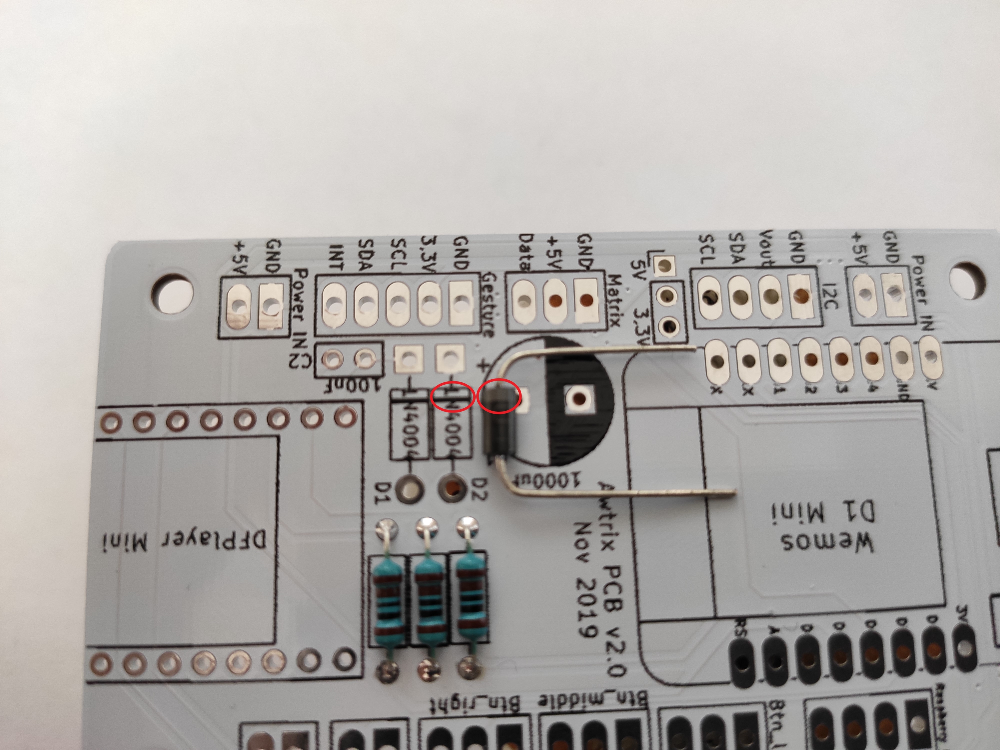

If you don't want to have a flying lead in the case, [you can buy a suitable board in my shop](https://blueforcer.de/shop/).

You can find the assembly diagram here:

| No | piece | name | part number (reichelt.de) | comment
| - | - |:------------------------:| :------------------------------:| |
| **1** | 2 | diode (1N4004) |1N 4004
| **2** | 3 | resistor (1k Ohm)| VIS C1001FC100 | |
| **3** | 1 | Capacitor (1000uF)| M-A 1000U 16 | **Horizontal installation** |
| **4** | 1 | Capacitor (100nF)| KERKO 100N |
| **5** | 1 | pinheader male (1x3) | MPE 087-1-036 |
| **6** | 4 | pinheader male (1x8) | MPE 087-1-036 | 

## Pictorial instructions for assembling the mainboard

### 1. components at a glance

- The touch sensors as well as the DFPlayer are optical parts and are not necessarily required for operation.
- For soldering the components a soldering iron including solder is needed.
- When assembling you work your way from the small to the large components.

### 2. resistors (R1, R2, R3)

- All three resistors have the same resistance value (1k Ohm).
- Resistors have no polarity, so it does not matter how you solder the component.
- Bend the resistors and plug them in.
- Put something under it so that the components can be put through.
- Solder from above on one side.
- Solder the other side of the resistor from below.
- Solder the first side from below again.
- Shorten the legs of the resistors.

### 3. diodes (D1, D2)

- Diodes have a polarity, which is very important and must be observed.
- Bend and plug in diodes.
- Put something underneath so that the components can be plugged through.
- Solder from above on one side.
- Solder the other side of the diode from below.
- Solder the first side of the diode from below again.
- Shorten the legs of the diodes.

Correctly soldered it looks as follows:

### 4. small capacitor (C2)

- This capacitor has no polarity, so it does not matter how it is installed.
- Bend the capacitor and plug it in.
- Solder on one side from above.
- Solder the other side of the capacitor from below.
- Solder the first side from below again.
- Shorten the legs of the capacitor.

### 5. pin header (1x 3-pin)

- Plug in, turn over the board and lay it down so that the pin header does not fall out.
- Solder the first pin from below - alignment of the pin header is done afterwards.
- Press the black part of the pin header from top to bottom with your fingernail while the other hand is used to heat the first soldered area with a soldering iron.
- Now the pin header should be straight. If not repeat the procedure.
- Solder the other pins of the pin header.
- **This pin header allows you to switch the power supply for your I2C bus variable between 3.3V and 5V. A jumper is used for this purpose.

### 6. socket connector (4x 8-pin)

- Plug in, turn over the board and lay it down so that the female connector strip does not fall out.
- Solder the first pin from below - alignment of the pin header is done afterwards.
- Press the black part of the female connector strip from top to bottom with your fingernail while the other hand is used to heat the first soldered area with a soldering iron.
- Now the female header should be straight. If not repeat the procedure.
- Solder the other pins of the female connector strip.
- Solder the other three female connectors in the same way

### 7. large capacitor (C1)

- **This capacitor must be installed FLAT. Otherwise it is too high for the Awtrix  housing.
- Capacitor has a white line on one side. This marks the negative pole.
- Place the capacitor on the board. The negative pole of the capacitor must be inserted into the pin surrounded by a black area.
- Bend the legs 90 degrees down.
- Insert the capacitor and solder one side from above.
- Solder the other side of the capacitor from below.
- Solder the first side from below again.
- Shorten the legs of the capacitor.

Correctly soldered it looks as follows:

### 8. DFPlayer

- Plug the pin header into the DFPlayer. (If it is not already soldered to it anyway)
- For soldering the pin header can be plugged into the already soldered socket connector.
- Place the DFPlayer on the pin header, which is plugged into the female connector, and solder it on.

### 9. wemos D1 mini

- Plug the pin headers into the Wemos D1 mini.
- The pin header must look down while the microcontroller and the antenna must look up.
- For soldering, the pin header can be plugged into the already soldered socket connector.
- Place the Wemos D1 mini on the pin header which is plugged into the socket connector and solder it on.

Correctly soldered in, it looks as follows:

### 10. DONE
- The components that can be connected to the mainboard are listed under Awtrix Pro assembly in another picture guide.
